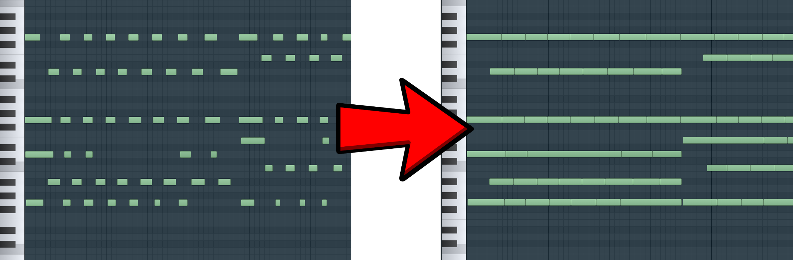

# 🎹 Sustain to Longer Notes

[](https://github.com/Teskann/sustain-to-longer-notes/actions/)
 [](https://opensource.org/licenses/MIT)

Convert a MIDI file with sustain pedal events to a midi file with
changed notes duration.



## Features

 * ✅ Convert sustain pedal events (controller 64) to longer notes
 * ✅ Remove overlapping notes in the MIDI file

## Installation

### Prerequisites

 * Python 3.8+
 * Make

### Install command

```commandline
make
```

## Usage

```
usage: sustain [-h] file [file ...]

Convert the sustain pedal MIDI events to longer notes.

positional arguments:
  file        Input MIDI file(s) to convert. The output file name(s) are the same as input but suffixed by '_sustained'.

options:
  -h, --help  show this help message and exit
```

## Examples

### Run on a single file

```commandline
sustain path/to/my_file.mid
```

This created the file `path/to/my_file_sustained.mid`.

### Run on a directory

```commandline
sustain path/to/my/directory
```

This has run on all `*.mid` and `*.MID` files in `path/to/my/directory`
and created the files `path/to/my/directory/*_sustained.mid`

## Compatibility

|             | Ubuntu 22.04 | Windows | Mac OS |
|-------------|:------------:|:-------:|:------:|
| Python 2.7  |       ❌      |    ❌    |    ❌   |
| Python 3.7  |       ⚠️      |    ⚠️    |    ⚠️   |
| Python 3.8  |       ✅      |    ✅    |    ✅   |
| Python 3.9  |       ✅      |    ✅    |    ✅   |
| Python 3.10 |       ✅      |    ✅    |    ✅   |
| Python 3.11 |       ✅      |    ✅    |    ✅   |

- ❌: Unsupported
- ⚠️: Not tested, but may work (not officially supported)
- ✅: Officially supported